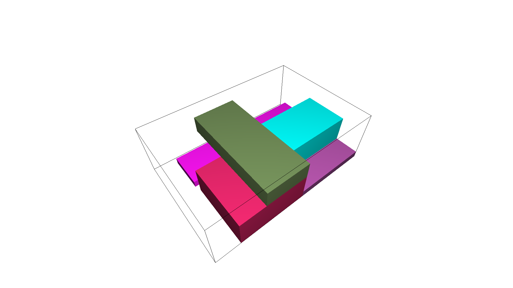

# Packing Algorithm of AIP

This section provides information about the packing algorithm that can be used on the AIP demonstrator. The original algorithm was developed by Matthias Reiplinger in his master thesis in and has been improved several times. Basis of the now implemented version of the packing algorithm is the bachelor thesis of Luisa Schlenker.

Since the packing algorithm was is originally written in a Jupyter notebook, the script was organised in several classes and interfaces were written in order to enable information transfer between classes and use it in combination with the existing Behavior Tree and ROS2. No modifications of the core algorithm were made, with two exceptions: the maximum container number of containers to be packed was limited to one. And the visualization was changed to be able to export an image of the calculated container. The transfer of information is no longer being done with Excel sheets or csv files, but now with dataframes. The material master is implemented using a YAML file.

Due to reasons of clear task seperation, some parts of Luisa Schlenker's original work, such as the calculation of the robot's grasp position, were transferred to the grasp planning repository.

## Procedure of the actual Implementation

In order to start the calculation of the optimal packaging sequence and ideal volume utilization, the ROS2-server "PackAlgorithm_Server" needs to receive a list of strings of objects to be packed. During the normal process, this is provided by the LLM.

The service starts the algorithm with the "Pack-Algorithm.py file. The algorithm then uses the objects from the LLM to calculate the "Packplan". For further information of procedure of the exact calculation, see the work of Matthias Reiplinger, Dominik Lipfert, Anton Schulz and Luisa Schlenker.

The output of the packing algorithm is the packplan. It is organized in a ROS2 message and contains the following information for each package:

- Class name
- Package dimensions
- Weight
- Rotation index
- Place coordinates

The packages in the packplan are arranged in the optimal packaging sequence and is processed into the needed format in the "Packplan_Processing.py" script. Furthermore, a visualization of the optimal finished container is made and sent back to the LMM via a topic. An example of the visualization can be seen in the following.



## How to start the PackAlgorithm server for test purposes

1. Start server in Terminal
    - Start Docker
    - Execute the following command:
    
    ```shell
    ros2 run pkg_pack_node pack_server
    ```

2. Execute a service call
    - Connect to the running container with the following command:
    
    ```shell
    docker exec -it aip_packing_planning bash
    ```

    - Execute the service call:

    ```shell
    ros2 service call pack_planning aip_packing_planning_interfaces/srv/PackSequence '{}'
    ```

3. Listen to SolutionFeedback Publisher
    - Connect to the running container with the following command:
    
    ```shell
    docker exec -it aip_packing_planning bash
    ```

    - Listen to the topic "solution_feedback" with the following command:

    ```shell
    ros2 topic echo solution_feedback
    ```

**Important**: For the simulation the following line in the "PackAlgorithm_Server.py" file must be **active**. Here the items to be packed can be typed in.

```shell
items = ["Box_Gluehlampe", "Box_Wischblatt", "Keilriemen_gross"]
```

The following line mus also be **deactivated**:

```shell
items = request.objects_to_pick
```
